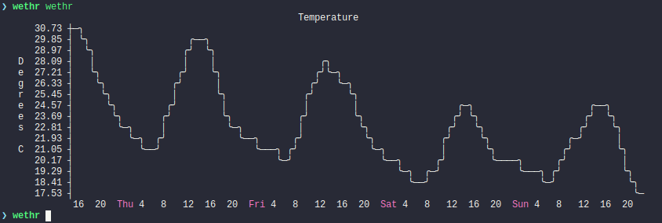

# wethr



Simple command line weather, built with performance and simplicity in mind.
Powered by [Darksky](https://darksky.net/dev), `wethr` will only re-download
weather after its old data has "expired" (1 hour by default).  It supports the
`minutely` and `hourly` forecasts.

# Installation

### Requirements

- [zsh](https://www.zsh.org/) (>= `zsh 5.6.2`)
- [jq](https://github.com/stedolan/jq) (>= `jq-1.5`)
- [plot](https://github.com/annacrombie/plot) (>= `plot v0.1.0`)
- [wget](https://www.gnu.org/software/wget) (>= `GNU Wget 1.20.3`)

### Environment

You must also obtain a Darksky api key [here](https://darksky.net/dev/register).
In addition, you need to know your current location in coordinates,
[latlon](https://github.com/annacrombie/latlon) might be something you are
interested in.  Or just use a map.

To set the api key, it must either be specified on the command line, or in your
environment as `DARKSKY_API_KEY`.  Similarly your lattitude and longitude may be
specified on the command line or in `LATLON` (in the format `lat:long`).

# Usage

```
$ wethr -h
usage: wethr [opts] [mode]
opts:
  -d, --data DATA add data to display
  -k, --keep      keep weather data even if it is stale
  -r, --refresh   refresh weather data even if it isn't stale
  -X, --no-x-axis disable drawing x-axis labels
  -C, --no-color  disable color output
  -w, --width     set output width
  -v, --verbose   enable more output
  -p, --profile   enable profiling output
  --api-key KEY   set DARKSKY_API_KEY
  --loc LAT:LONG  set your location
  --no-ff         don't fast forward to current time
  -h, --help      duh
mode:
  m, minutely     display minutely data
  h, hourly       display hourly data

DATA:
  w - Wind Speed (m/s)
  g - Wind Gust (m/s)
  h - Humidity (Percent)
  i - Precip. Intensity (mm/h)
  o - Ozone (Dobson Units)
  p - Precip. Probability (Percent)
  P - Atmospheric Pressure (hPa)
  a - Feels Like (Degrees C)
  b - Wind Bearing (Degrees)
  t - Temperature (Degrees C)
  c - Cloud Cover (Percent)
  u - UV Index (Index)
  d - Dew Point (Degrees C)
  v - Visibility (km)
```
